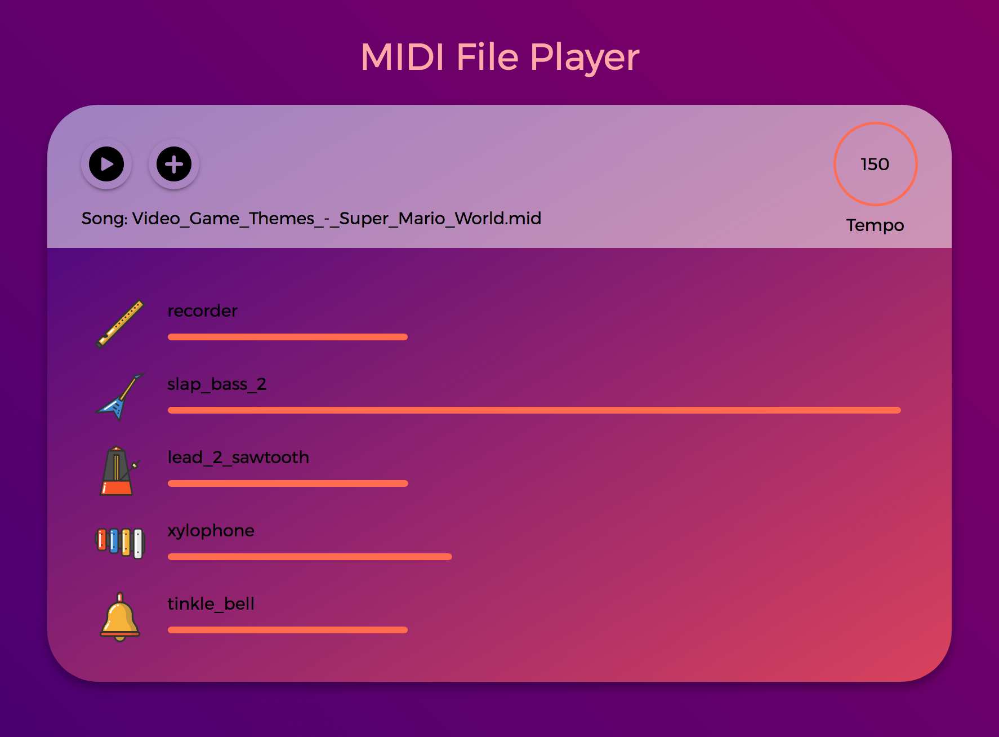
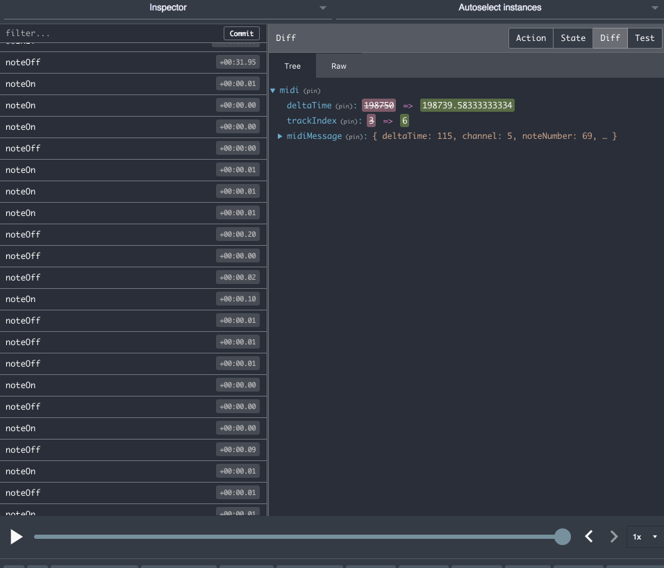

# MIDI Redux

This is a sandbox project to learn the following concepts:

* How Redux works
* How React works
* How to integrate React & Redux
* How MIDI works (harder than expected)

## Schema


## Demo

1. Open [elenatorro.github.io/midi-redux](https://elenatorro.github.io/midi-redux)
2. Load a MIDI (.mid) file (you can find some examples [here](https://github.com/elenatorro/midi-redux/tree/master/midi-songs)
3. Play!

## Installation

1. Install packages
```
$ npm install && bower install
```

1. Compile:
```
$ webpack
```

3. Run:
```
 webpack-dev-server --progress --colors --watch
```

4. Open [http://localhost:8080/webpack-dev-server/](http://localhost:8080/webpack-dev-server/)

## Load instruments

5. If you want to load your own instruments or load local files, you can change the configuration in `src/config/instruments-path`. I am using this project the sounds from this project: [Soundfont](https://github.com/gleitz/midi-js-soundfonts)

6. Find a great midi song on the Internet:
  * http://www.midiworld.com/files/
  * https://freemidi.org/
  * etc...

7. Load your .mid file and play it!


## Screenshot



## Redux DevTools



**FEEDBACK & HELP are super welcome**. It's my first project using React&Redux. I think it could be a very beautiful project :)
